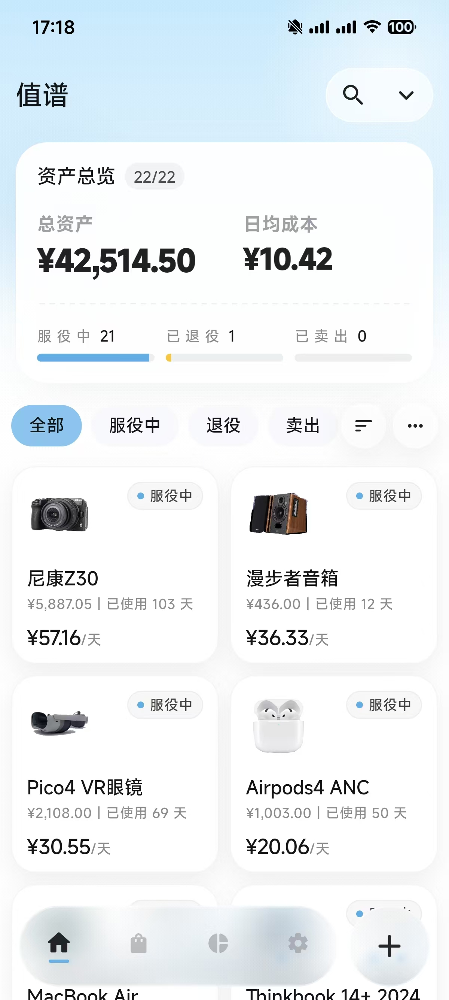
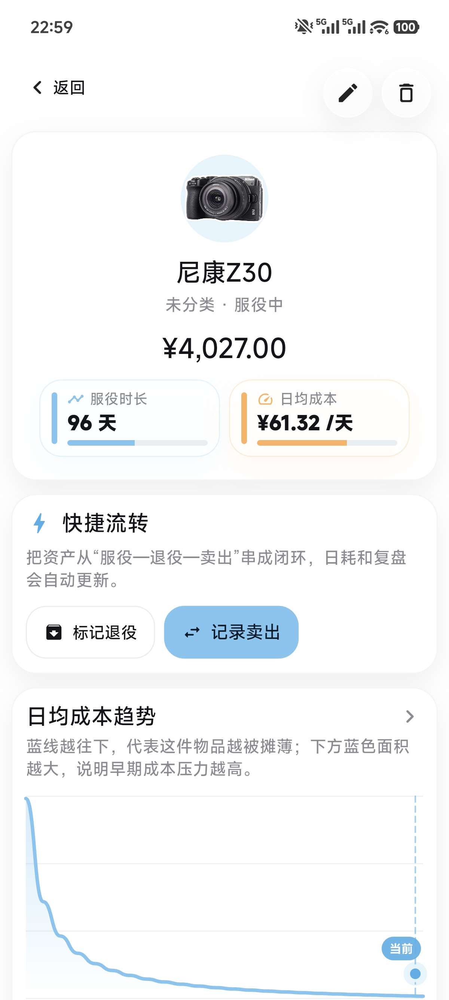
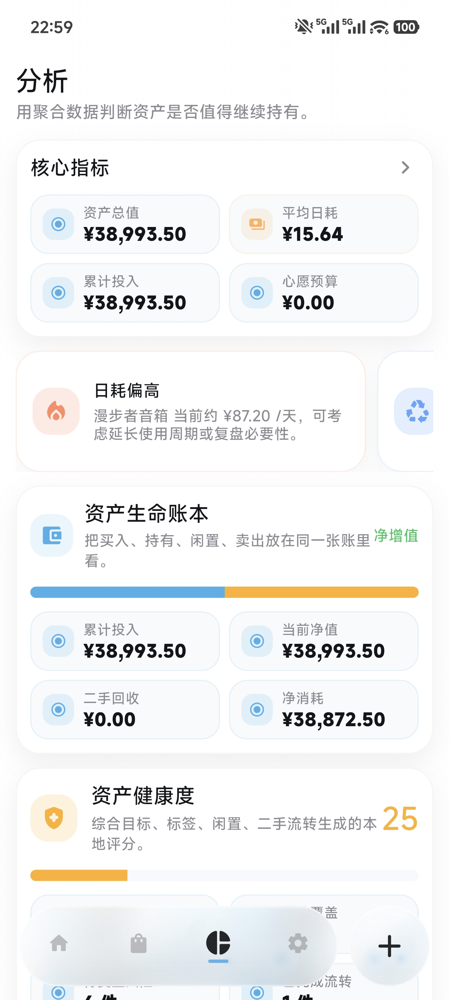
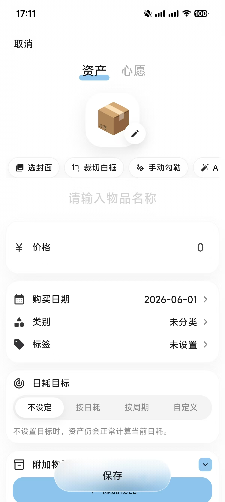
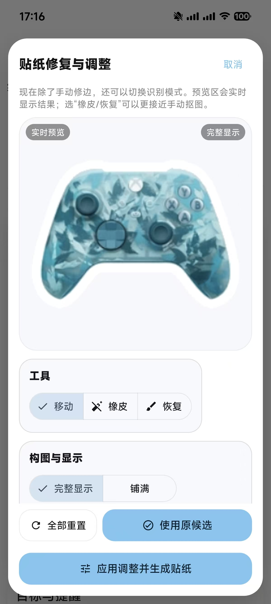
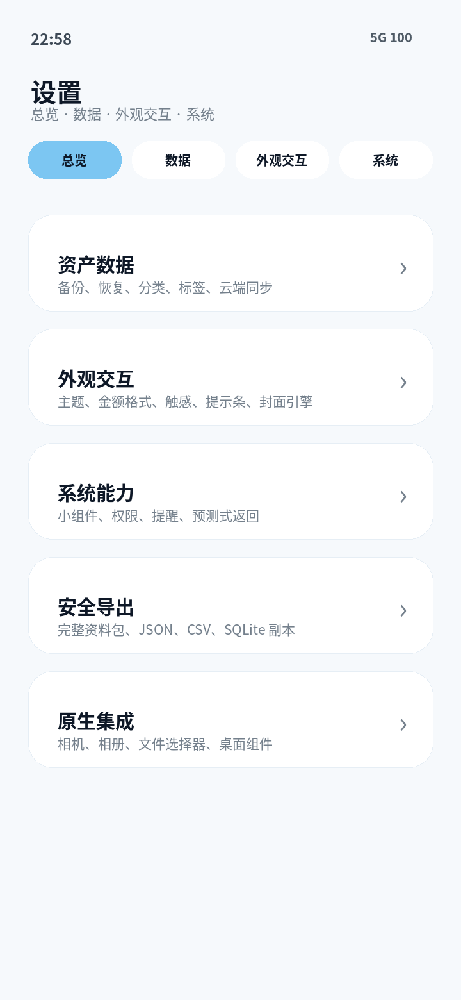
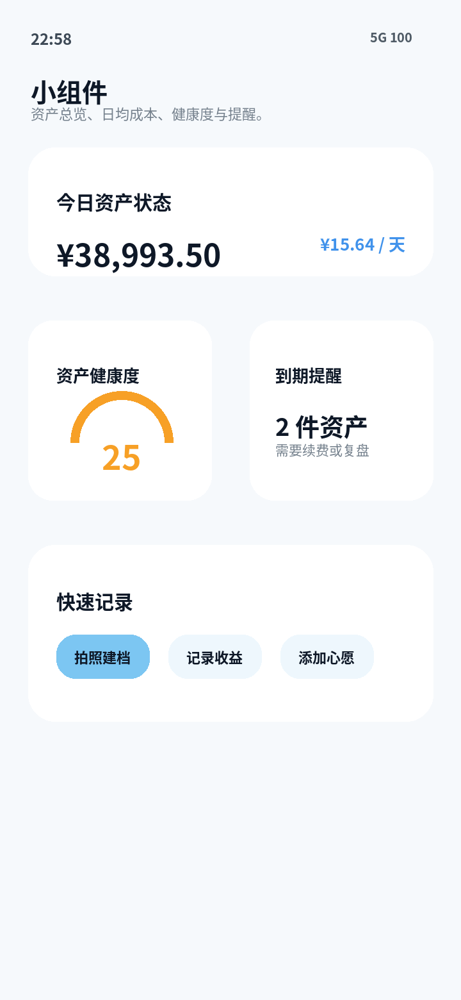

<p align="center">
  
</p>

<h1 align="center">Valora · 值谱</h1>

<p align="center"><strong>把每一次购买，变成一条看得见的价值轨迹</strong></p>

<p align="center">本地优先的个人资产生命周期管理 App · Android / Flutter</p>

<p align="center">
  <a href="#开始使用">开始使用</a> ·
  <a href="#核心能力">核心能力</a> ·
  <a href="#数据与隐私">数据与隐私</a> ·
  <a href="#文档导航">文档导航</a>
</p>

---

> Valora 不是记账工具。它关心的不是“花了多少钱”，而是“这件东西今天是否仍然值得”

一台 8,000 元的手机，使用四年后的日均成本可能很低；一件 500 元的配件，三天后闲置，反而值得被重新审视。Valora 将物品、价格、使用时间、目标、回收与收益放进同一条时间线，帮助你用更长期的视角理解消费

## 界面预览

<p align="center">
  
  
  
</p>

<p align="center">
  
  
  
  
</p>

<p align="center"><sub>截图使用示例资产数据，展示首页、详情、分析、录入、封面、设置与小组件</sub></p>

## 一眼了解

| 项目 | 说明 |
| --- | --- |
| 当前版本 | `0.80.1+81` |
| 平台 | Android，Flutter 构建 |
| 最低 Android 版本 | Android 7.0 / API 24 |
| 数据策略 | 本地优先，云同步按需开启 |
| 包名 | `valora_assets` |
| Android applicationId | `com.valora.assets` |
| 许可 | [Apache License 2.0](LICENSE) |

## 为长期使用的物品而设计

Valora 适合记录那些会陪伴你一段时间、也值得被复盘的东西

- 数码设备：手机、电脑、相机、耳机、手表
- 长期消费品：家具、家电、通勤和摄影装备
- 持续投入：订阅、课程、工具、配件
- 待购与换新计划：心愿、目标、旧物转卖与归档

它将“买入”之后的使用、目标、闲置、收益与回收关联起来，让一条购买记录逐渐成为一份个人资产档案

## 核心能力

| 能力 | 你能看到什么 | 它帮助你判断什么 |
| --- | --- | --- |
| 日均成本 | 价格、服役天数、日均成本与下降趋势 | 一件物品是否越用越值 |
| 生命周期 | 服役、退役、卖出、归档状态与目标进度 | 是否达到预期使用周期 |
| 资产分析 | 趋势、排行、分类占比、价值复盘 | 钱主要花在何处，哪些物品最划算 |
| 价值回收 | 二手回收与使用收益 | 一件物品实际沉淀了多少价值 |
| 封面与贴纸 | 图片封面、主体抠图、贴纸描边与修边 | 让资产库更像一本可阅读的图鉴 |
| 备份与恢复 | JSON、CSV、Markdown 报告、SQLite 与完整资料包 | 换机或整理前能安全留档 |

### 日均成本，而不是一次性价格

日均成本会随着使用时间动态变化。Valora 以净投入与服役天数为基础展示成本，并在详情与分析页中持续呈现趋势；转卖回收和记录的使用收益也会进入价值复盘

```text
日均成本 = 净投入 ÷ 服役天数
价值回收 = 二手卖出回收 + 使用收益
```

### 从记录到复盘

1. 新增一件资产，填写价格、日期、分类、标签与封面
2. 设定目标日均、预计使用周期或到期日期
3. 在详情中观察服役天数、成本下降与目标进度
4. 在分析页比较趋势、分类占比、高成本项目与最划算资产
5. 在卖出、闲置或换新时记录回收与收益，完成一次消费复盘

## 应用体验

### 资产库与心愿清单

- 首页提供总资产、日均成本、状态分布、高成本提醒与最近资产
- 资产支持搜索、排序、分类筛选、标签与归档
- 心愿可独立管理，并在购买后转换为资产
- 支持卡片、列表与贴纸式浏览，适配手机与较宽的 Android 屏幕

### 详情、目标与分析

- 资产详情集中展示购买信息、使用天数、当前成本、目标与价值变化
- 分析页提供总投入、日均成本趋势、分类占比、生命周期分布、排行与价值复盘
- 图表和排行榜可以进一步查看明细或进入对应资产
- 快照可用于创建、查看、恢复、重命名与删除某一时刻的资产状态

### 封面制作与视觉整理

- 支持图片封面、裁切白框封面与贴纸化展示
- 支持主体勾勒、多候选结果、缩放定位、边缘清理、橡皮、恢复笔与撤销修边
- 浅色界面以白色与冷灰为主，深色界面保留深蓝层次
- Dock、添加与保存操作使用场景级液态玻璃；可在设置中切换经典毛玻璃，并通过“玻璃柔化”调整通透、模糊与乳化质感

### 数据、同步与 Android 能力

- 默认将数据保存在设备本地的 SQLite 数据库中
- 支持导入导出 JSON、CSV、Markdown 报告、数据库副本、媒体清单和完整 ZIP 资料包
- 可选 WebDAV、坚果云、Nextcloud 与自定义 WebDAV 同步
- 提供资产总览、心愿、日均成本、体检、快速记录、提醒和快照等 Android 小组件
- 触感反馈、原生震动、紧凑提示条、主题、语言与玻璃效果均可在设置中调整

## 数据与隐私

Valora 采用本地优先设计。资产、心愿和绝大多数配置默认保存在应用私有目录中；相机、识别、扫描、封面处理与网络同步只会在你主动使用对应功能后触发

- 云同步不是必需项，只有启用并填写配置后才会访问网络
- 导出文件由系统文件选择器保存到你指定的位置
- 发布问题截图或备份前，请移除真实资产、账户名称、WebDAV 地址、路径和其他私人信息

完整说明见[技术与构建指南](docs/guides/TECHNICAL_GUIDE.md#数据与隐私说明)

## 开始使用

### 环境要求

- Flutter stable，Dart `>=3.3.0 <4.0.0`
- JDK 17
- Android SDK 或 Android Studio
- 一台 Android 真机或模拟器

### 运行

```bash
flutter pub get
flutter run
```

### 构建 APK

```bash
# Debug
flutter build apk --debug

# Release
flutter build apk --release
```

输出位置：

```text
build/app/outputs/flutter-apk/app-debug.apk
build/app/outputs/flutter-apk/app-release.apk
```

release 配置用于本地测试。正式发布前，请创建自己的签名密钥，并通过本地 `key.properties` 或 CI Secret 管理；不要将证书、密码或 `android/local.properties` 提交到仓库

## 项目结构

```text
lib/
├── main.dart                  # Flutter 入口与模块组织
└── src_parts/                 # 页面、模型、状态、公共组件与原生桥接

android/app/src/main/java/com/valora/assets/
├── MainActivity.java          # Android 原生能力与 MethodChannel
└── *WidgetProvider.java       # Android 小组件

assets/images/                 # 应用资源
docs/                          # 使用、构建、产品与发布文档
```

## 文档导航

| 需要了解 | 文档 |
| --- | --- |
| 如何使用应用 | [用户使用教程](docs/guides/USER_GUIDE.md) |
| 环境、构建、目录和权限 | [技术与构建指南](docs/guides/TECHNICAL_GUIDE.md) |
| Release 构建常见问题 | [Flutter Release APK 编译流程](docs/guides/BUILD_PROCESS.md) |
| 开源发布前检查 | [开源发布检查清单](docs/guides/OPEN_SOURCE_RELEASE.md) |
| 当前版本更新内容 | [v0.80 Release Notes](docs/v80_github_release_notes.md) |
| 全部文档 | [docs/README.md](docs/README.md) |

## 第三方声明

液态玻璃效果使用 [`liquid_glass_easy`](https://pub.dev/packages/liquid_glass_easy) `2.0.1`。该依赖采用 MIT License；其完整版权声明和许可文本保留在 [THIRD_PARTY_NOTICES.md](THIRD_PARTY_NOTICES.md)

## 参与贡献

欢迎提交 Issue 或 Pull Request。提交前请尽量完成以下检查：

```bash
dart format .
flutter analyze
flutter build apk --debug
```

贡献流程见 [CONTRIBUTING.md](CONTRIBUTING.md)

## 许可证

本项目使用 [Apache License 2.0](LICENSE)，项目归属和补充说明见 [NOTICE](NOTICE)
