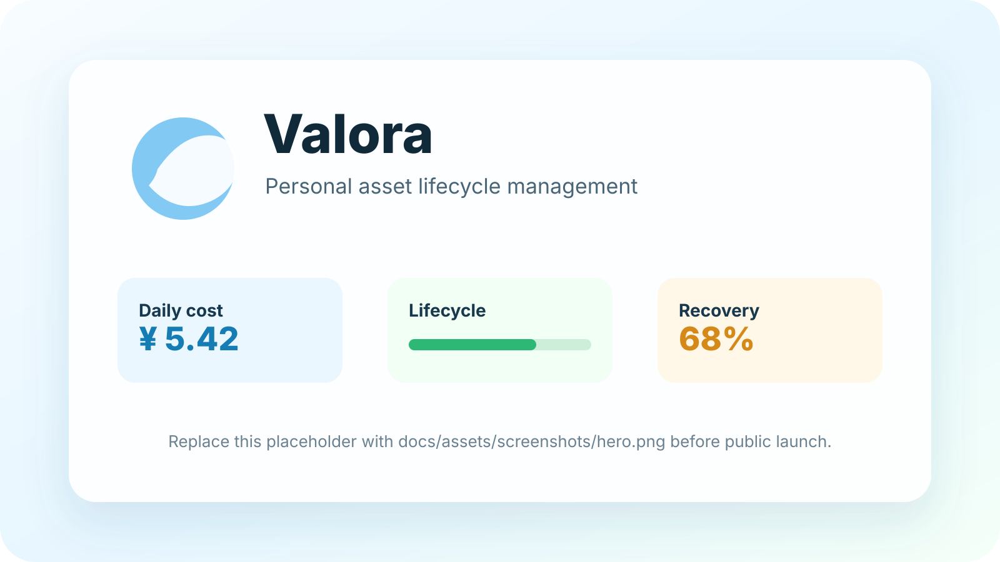

<div align="center">
  
  <h1>Valora（值谱）</h1>
  <p><strong>让每一件物品的价值，都有迹可循。</strong></p>
  <p>A clean personal asset tracker that turns purchases into daily cost, lifecycle, and value insights.</p>

  <p>
    
    
    =3.3.0 <4.0.0" />
    
    
    <a href="LICENSE"></a>
  </p>
</div>

## 简介

Valora（值谱）是一款面向个人物品、数码产品和长期消费品的资产价值管理 App。它不是传统记账软件，而是把购买记录转化为日均成本、生命周期和价值洞察，帮助你从“我花了多少钱”进一步理解“这件东西到今天为止值不值”。

它适合记录手机、电脑、相机、耳机、家电、订阅、课程、工具和其他长期消费品，并围绕日均成本、目标值得线、生命周期、闲置/转卖和价值回收，形成一套本地优先的个人资产复盘方式。

## 目录

- [简介](#简介)
- [预览与宣传图](#预览与宣传图)
- [项目概览](#项目概览)
- [核心特色](#核心特色)
- [主要功能](#主要功能)
- [页面结构](#页面结构)
- [技术与构建](#技术与构建)
- [开源发布建议](#开源发布建议)
- [贡献](#贡献)
- [许可证](#许可证)

## 预览与宣传图

<p align="center">
  
</p>

正式公开前建议把上面的占位图替换成脱敏宣传图：

```text
docs/assets/screenshots/hero.png
```

截图建议放在 `docs/assets/screenshots/`，优先展示：

- 首页资产总览和日均成本卡片。
- 资产详情页的生命周期和目标日均。
- 分析页的趋势、排行和价值复盘。
- 封面/贴纸编辑能力。
- 设置里的备份、同步和小组件入口。

不要提交包含个人资产、账号、WebDAV 地址或其他隐私内容的真实截图。

## 项目概览

| 项目 | 内容 |
| --- | --- |
| 当前版本 | `0.79.0+79` |
| 英文名 | Valora |
| 中文名 | 值谱 |
| Flutter package | `valora_assets` |
| Android applicationId | `com.valora.assets` |
| Android 最低版本 | `minSdk 24` |
| 当前重点 | Android APK 构建与本地优先体验 |
| 数据策略 | 本地优先，云端同步为可选能力 |

> 开源前请确认你拥有本项目代码、图标、图片、模型、文案和第三方素材的公开授权。如果项目中存在个人数据、私有备份、签名证书或未授权资源，请先移除后再推送到 GitHub。

> 建议把 `valora_app/` 的内容作为 GitHub 仓库根目录发布；外层 `archives/`、宣传站 `valora-site/`、本地压缩包和构建产物不进入源码仓库。APK 请通过 GitHub Releases 作为附件发布。

## 核心特色

**不是记账，而是价值复盘**

普通记账关心“我花了多少钱”，值谱关心“这笔钱到今天为止值不值”。一个 8000 元手机用了 4 年，日均成本可能已经很低；一个 500 元配件用了 3 天就闲置，反而可能更不划算。

**日均成本视角**

值谱会根据购买价格和使用天数计算日均成本。随着使用时间增加，用户能直观看到“用得越久越值”的过程。

```text
日均成本 = 已消耗成本 / 持有天数
```

**生命周期管理**

每件物品不只是一条消费记录，而是一个有状态的资产：新购入、高频使用、稳定使用、闲置、转卖、报废、归档。它帮助用户判断一件东西是否还在发挥价值。

**目标日均 / 值得线**

用户可以设置目标，比如手机希望用到日均 5 元以下、相机至少使用 3 年、耳机用满 1000 天。App 会根据当前使用时间计算距离目标还有多久、是否已经达标、是否因为提前闲置而不划算。

**本地优先与完整备份**

默认数据保存在本机。用户可以导出 JSON、CSV、Markdown 报告、SQLite 副本、媒体清单和完整资料包 ZIP，也可以选择 WebDAV、坚果云、Nextcloud 或自定义 WebDAV 做云端同步。

## 主要功能

- 首页仪表盘：总资产、日均成本、服役/退役/卖出状态、资产总览、高成本提醒和最近物品。
- 资产管理：记录名称、分类、标签、价格、购买日期、封面、状态、目标周期、备注、估算剩余价值和使用收益。
- 资产详情：展示购买价格、购买日期、已使用天数、当前日均成本、目标日均、生命周期进度、价值变化和成本下降趋势。
- 心愿清单：记录待购资产，并支持从心愿转换为正式资产。
- 分析页面：提供日均成本趋势、目标预测曲线、分类占比、高成本排行、生命周期分布和价值复盘。
- 封面制作：支持 AI 贴纸封面、裁切白框封面、手动勾勒、贴纸缩放定位、边缘清理和撤销修边。
- 快照管理：支持创建、查看、恢复、重命名和删除资产快照。
- 数据备份：支持 JSON、CSV、Markdown 报告、SQLite 副本、媒体清单和完整资料包 ZIP。
- 可选云同步：支持 WebDAV、坚果云、Nextcloud 和自定义 WebDAV 地址。
- Android 小组件：提供资产总览、心愿清单、日均成本、资产体检、快速记录、到期提醒和资产快照。

## 页面结构

```text
Valora（值谱）
├── 首页
│   ├── 数据总览
│   ├── 日均成本
│   ├── 资产概览
│   ├── 高成本提醒
│   └── 最近物品
├── 资产
│   ├── 物品列表
│   ├── 分类筛选
│   ├── 搜索排序
│   ├── 物品详情
│   └── 归档 / 删除
├── 心愿
│   ├── 心愿列表
│   └── 转为资产
├── 分析
│   ├── 日均成本趋势
│   ├── 目标预测曲线
│   ├── 分类占比
│   ├── 生命周期分析
│   └── 价值复盘
└── 设置
    ├── 数据备份
    ├── 云端同步
    ├── 外观交互
    └── 系统能力
```

## 技术与构建

README 只保留产品和开源入口。更具体的技术栈、环境配置、构建命令、目录说明、权限解释和开源检查项请查看：

- [文档索引](docs/README.md)
- [技术与构建指南](docs/guides/TECHNICAL_GUIDE.md)
- [用户使用教程](docs/guides/USER_GUIDE.md)
- [Flutter Release APK 编译流程与问题记录](docs/guides/BUILD_PROCESS.md)
- [开源发布检查清单](docs/guides/OPEN_SOURCE_RELEASE.md)

快速构建 Debug APK：

```bash
flutter clean
flutter pub get
dart format .
flutter analyze
flutter build apk --debug
```

输出位置：

```text
build/app/outputs/flutter-apk/app-debug.apk
```

## 开源发布建议

首次推送 GitHub 前，建议检查：

- 不提交 `android/local.properties`、`.env`、`key.properties`、`*.jks`、`*.keystore` 等本机路径或签名密钥。
- 不提交 `build/`、`.dart_tool/`、`.gradle/`、APK/AAB、临时日志和个人备份 ZIP。
- APK 安装包建议上传到 GitHub Releases，并命名为类似 `Valora-v0.79.0-android.apk` 的公开文件名。
- Flutter App 建议提交 `pubspec.lock`，这样其他人能复现当前依赖解析结果。
- 保留或替换当前 `LICENSE` 文件。本仓库默认采用 Apache License 2.0，并提供 `NOTICE` 项目归属说明。
- 如果后续添加截图，先确认截图不包含个人资产、账号、WebDAV 地址或其他隐私信息。
- 如果使用 GitHub，建议启用 `.github/workflows/flutter.yml` 中的格式化、静态分析和 Debug APK 构建检查。

## 贡献

欢迎通过 Issue 或 Pull Request 改进项目。更完整的流程见 [CONTRIBUTING.md](CONTRIBUTING.md)。提交 PR 前请尽量保证：

- 代码已格式化：`dart format .`
- 静态分析通过：`flutter analyze`
- 至少能构建 Debug APK：`flutter build apk --debug`
- 涉及数据迁移、备份恢复、原生桥接或权限变更时，在 PR 描述中写清测试方式和影响范围。

## 许可证

本项目使用 [Apache License 2.0](LICENSE)。项目归属和补充声明见 [NOTICE](NOTICE)。
